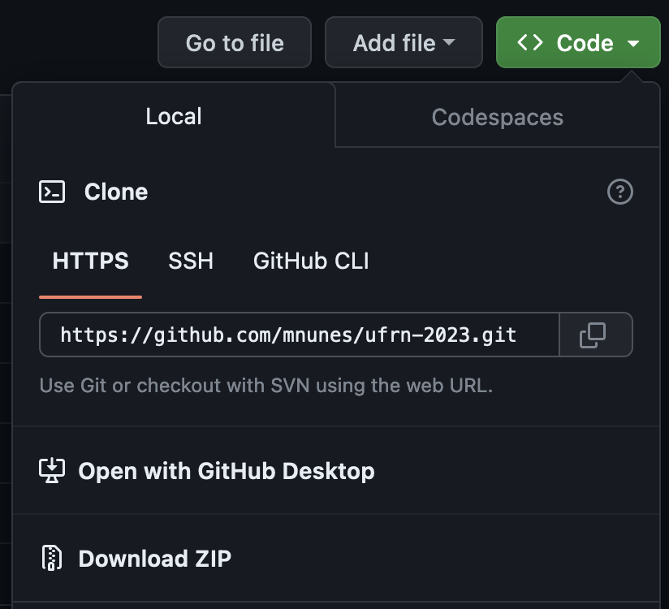

# Construindo Mapas no R

## Resumo

Este minicurso aborda a criação de mapas utilizando o software R. Ele começará com uma introdução aos pacotes específicos para manipulação e visualização de dados espaciais. Os participantes aprenderão como construir mapas adicionando informações estatísticas a eles. Serão abordados exemplos com mapas mundiais, nacionais e estaduais.

Ao final do minicurso, os participantes terão adquirido as habilidades necessárias para criar mapas atraentes e informativos no R, permitindo-lhes comunicar efetivamente informações geográficas por meio de visualizações. O único pré-requisito para acompanhar o minicurso é conhecer as funções básicas do pacote tidyverse.

## Introdução

Esse minicurso é uma introdução prática à criação de mapas utilizando os pacotes `leaflet` do R.

Ele foi parte da programação científica da [Semana da Estatística da UFRN - "Estatística e Ciência de Dados"](https://docs.google.com/forms/d/e/1FAIpQLScLKYaYGwIWP8XBPCjXjv7sQx42xu7unbXItuDOmubJAZPoMQ/viewform), ocorrida durante os dias 3 e 4 de Outubro de 2023.

## Software Necessário

É necessário instalar os seguintes programas em seu computador:

- R: [https://cran.r-project.org/](https://cran.r-project.org/)
- RStudio: [https://www.rstudio.com/products/rstudio/download/](https://www.rstudio.com/products/rstudio/download/)
- Alguns pacotes do R devem ser instalados ou rodando o comando `source("https://raw.githubusercontent.com/mnunes/shiny_ufes/master/scripts/setup.R")` no seu RStudio ou clicando em [https://raw.githubusercontent.com/mnunes/shiny_ufes/master/scripts/setup.R](https://raw.githubusercontent.com/mnunes/shiny_ufes/master/scripts/setup.R) e copiando e colando seu conteúdo dentro do RStudio

## Como Utilizar este Repositório

Clone os arquivos em seu computador utilizando o github ou clique no botão verde acima onde está escrito `Code` e escolha a opção `Download ZIP`

Acompanhe o curso com o material didático incluído na pasta raiz que será criada. Abra o projeto `ufrn-2023` e siga a minicurso abrindo cada um dos markdowns em sequência, de acordo com o número colocado em seu nome.

Esse minicurso foi preparado por [Marcus Nunes](https://marcusnunes.me), Professor Adjunto do Departamento de Estatística da UFRN, coordenador do [laboratório de Estatística Aplicada](http://lea.estatistica.ccet.ufrn.br) e vice-coordenador do [Laboratório de Ciência de Dados](http://lacid.ccet.ufrn.br). Os dados utilizados foram obtidos a partir do [site da UNESCO](https://whc.unesco.org/en/syndication), [IBGE](https://www.ibge.gov.br/geociencias/organizacao-do-territorio/estrutura-territorial/15774-malhas.html)

